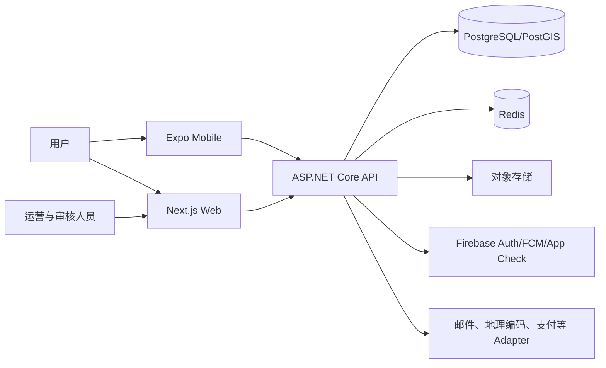

# 系统上下文

```mermaid
flowchart LR
  User[用户] --> Mobile[Expo Mobile]
  User --> Web[Next.js Web]
  Admin[运营与审核人员] --> Web
  Mobile --> API[ASP.NET Core API]
  Web --> API
  API --> PG[(PostgreSQL/PostGIS)]
  API --> Redis[(Redis)]
  API --> Storage[对象存储]
  API --> Firebase[Firebase Auth/FCM/App Check]
  API --> Providers[邮件、地理编码、支付等 Adapter]
```

ASP.NET API 是业务规则、授权和状态转换的唯一事实源。PostgreSQL 是业务数据唯一真源；Firebase 只承担身份和移动平台能力。
